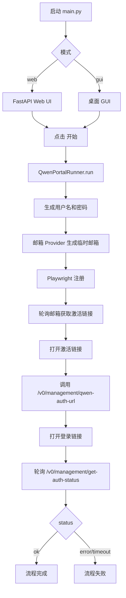

# qwen-auto-register 代码结构说明

本文档描述当前精简版架构（已将历史无关模块归档）。

## 1. 当前目录结构

```text
qwen-auto-register/
├── README.md
├── ARCHITECTURE.md
├── Dockerfile
├── docker-compose.yml
├── scripts/
│   └── start.ps1
└── src/
    └── auto_register/
        ├── main.py
    ├── web/
    │   ├── __init__.py
    │   └── app.py
        ├── gui/
        │   ├── app.py
        │   └── log_panel.py
        ├── providers/
        │   ├── one_sec_mail_provider.py
        │   └── username_provider.py
        ├── integrations/
        │   ├── qwen_portal.py
        │   ├── cli_proxy_management_client.py
        │   └── ARCHIVED_LEGACY.md
        ├── utils/
        │   └── ARCHIVED_LEGACY.md
        ├── writer/
        │   └── ARCHIVED_LEGACY.md
        └── archive/
            ├── README.md
            └── legacy/
                ├── integrations/qwen_oauth_client.py
                ├── utils/cpa_push.py
                ├── utils/gateway.py
                ├── utils/token_utils.py
                └── writer/auth_profiles_writer.py
```

## 2. 当前活动流程

1. 自动注册
2. 自动激活
3. 请求远程管理 API 获取登录链接
4. 打开登录链接并轮询远程认证状态
5. 认证文件由远程 CLI Proxy API 维护



## 3. 核心模块职责

- src/auto_register/integrations/qwen_portal.py
  - 主编排器：注册、激活、远程链接认证。

- src/auto_register/integrations/cli_proxy_management_client.py
  - 远程管理 API 客户端：qwen-auth-url、get-auth-status、auth-files。

- src/auto_register/providers/one_sec_mail_provider.py
  - 临时邮箱适配（Mail.tm / 1secMail / Cloud Mail）。

- src/auto_register/providers/username_provider.py
  - 随机用户名生成。

- src/auto_register/web/app.py
  - Web 控制台：启动任务、查看实时日志、查看运行状态。

## 4. 归档策略

已移除活动调用但保留源码的模块统一放在：

- src/auto_register/archive/legacy/

原目录保留 ARCHIVED_LEGACY.md 指向归档位置，便于后续追溯和按需恢复。

## 5. 关键环境变量

```dotenv
QWEN_AUTH_MODE=cli-proxy-api-remote
CLI_PROXY_API_BASE_URL=http://server:8056
CLI_PROXY_API_KEY=your-management-key
AUTO_REGISTER_EMAIL_PROVIDER=mailtm|1secmail|cloudflare
```
